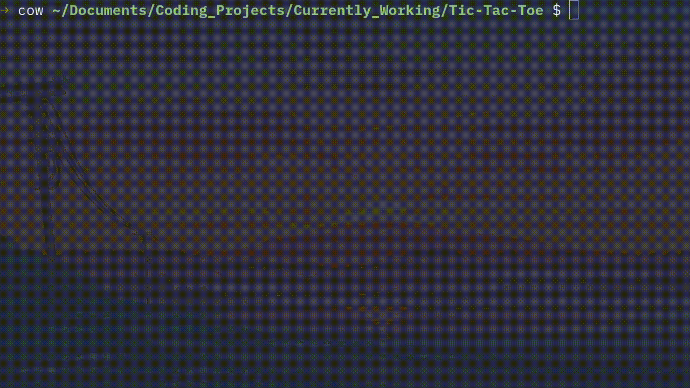

<h1 align='center'>⭕ Tic Tac Toe ❌</h1>

<h4 align='center'>A simple text-based Tic Tac Toe game</h4>

<br>



- [Live](https://youtu.be/fyyAbnv8lSY) demonstration video.
- [Demo](https://replit.com/@KingCao/Tic-Tac-Toe?v=1) the Project.


<!-- ABOUT THE PROJECT -->
## About The Project

This is a simple text based tic tac toe game.

I just wanted to revisit an old school game of mine where I absolutely crushed all those
other elementary school students with this game. Very nostalgic indeed.

### Built With

Python3.

<!-- GETTING STARTED -->
## Getting Started

The following instructions will help you get set up locally. Don't hesitate to message me if you have any problems!

### Prerequisites

- [python 3](https://www.python.org/downloads/)

### Installation

1. Clone the repo
```sh
git clone git@github.com:dave-cao/Tic-Tac-Toe.git
```


<!-- USAGE EXAMPLES -->
## Usage

1. Run the application
```sh
python3 main.py
```

2. Exit application
```
ctl + c
```

_For a more comprehensive example of using this application, refer to this [video](https://youtu.be/fyyAbnv8lSY)_


<!-- ROADMAP -->
## Roadmap

No future plans for this project. Perhaps further developing this game, I would use a python library like Pygame and make it more interactive.


<!-- CONTRIBUTING -->
## Contributing

Contributions are what make the open source community such an amazing place to learn, inspire, and create. Any contributions you make are **greatly appreciated**.

If you have a suggestion that would make this better, please fork the repo and create a pull request. You can also simply open an issue with the tag "enhancement".
Don't forget to give the project a star! Thanks again!

1. Fork the Project
2. Create your Feature Branch (`git checkout -b feature/AmazingFeature`)
3. Commit your Changes (`git commit -m 'Add some AmazingFeature'`)
4. Push to the Branch (`git push origin feature/AmazingFeature`)
5. Open a Pull Request


<!-- CONTACT -->
## Contact

#### David Cao
- Email: sirdavidcao@gmail.com
- [Youtube](https://www.youtube.com/channel/UCEnBPbnNnqhQIIhW1uLXrLA)
- [Linkedin](https://www.linkedin.com/in/david-cao99/)
- Personal Website: https://davidcao.xyz/
- Project Link - https://github.com/dave-cao/Tic-Tac-Toe


